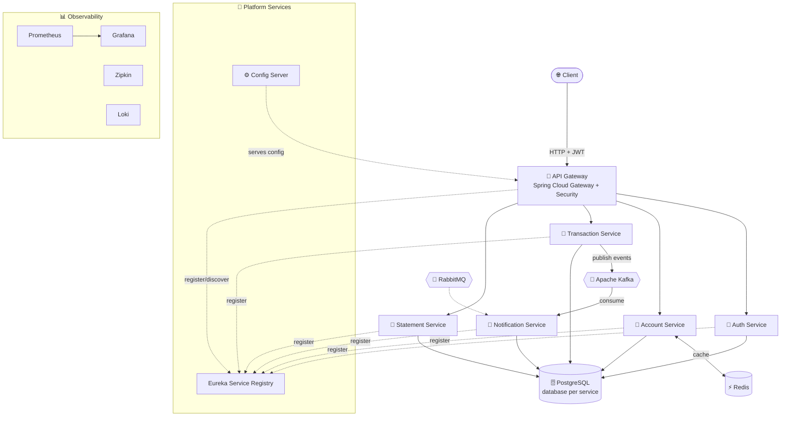

<div align="center">


[](https://www.linkedin.com/in/priyanshu-singh-1bb7a51b5/)
[](psingh2001singh@gmail.com)
[](#)


</div>


### 🚀 About Me

> 💙 I write Java that talks to databases, and databases that don't crash at 2 AM.

- 🏗️ Built a **distributed, microservices-based systems** — currently architecting a full-scale **Banking System** with independent Auth, Account, Transaction & Notification services
- 🛍️ Shipped **Erangel FashionHub** — a production e-commerce platform end-to-end, from database design to payment gateway integration
- 💼 **Actively looking for **Java Backend / Full-Stack Developer** opportunities
- ⚙️ Deep diving into **Java Collections internals, Concurrency, and Spring Boot internals** for interview-grade mastery
- 🧩 I enjoy untangling gnarly bugs as much as designing clean architecture from scratch
- 📫 Reach me at **[psingh2001singh@gmail.com](mailto:psingh2001singh@gmail.com)**

> * "Make it work, make it right, make it fast." — Kent Beck


### 🛠️ Tech Stack

**Languages**


**Backend & Frameworks**


**Architecture & Messaging**


**Databases & Caching**


**DevOps & Tools**


**Frontend (Familiar)**


---

### 💼 Experience

**Diginique Techlabs — Frontend Developer Intern**
*Under IIT Roorkee iHUB DivyaSampark*
- Built React-based UI components for production applications
- Collaborated in an Agile environment on real client deliverables

**Taxtron Pvt Ltd — Network Engineering Intern**
*Jun 2024 – Aug 2024*
- Worked on network infrastructure and troubleshooting in a live enterprise environment

---

### 📌 Featured Projects

<table>
<tr>
<td width="50%">

<div align="center">

# 🏦 Distributed Banking System — Microservices Architecture

### *A production-style, event-driven banking backend built with Spring Boot Microservices*

Powered by **Spring Cloud**, **Netflix Eureka**, **API Gateway**, **Apache Kafka**, **RabbitMQ**, **Redis** and **PostgreSQL** — designed with clean service boundaries, event-driven communication, and centralized routing, configuration & security.

<br>


<br>


<br>

🐞 [Report Bug](https://github.com/Commandarprime/distributed-banking-system/issues) · ✨ [Request Feature](https://github.com/Commandarprime/distributed-banking-system/issues)

</div>

---

## 📑 Table of Content

- [Overview](#-overview)
- [System Architecture](#-system-architecture)
- [Microservices](#-microservices)
- [Key Features](#-key-features)
- [Tech Stack](#-tech-stack)
- [Project Structure](#-project-structure)
- [Getting Started](#-getting-started)
- [Running the Services](#-running-the-services)
- [Docker & Infrastructure Setup](#-docker--infrastructure-setup)
- [Service Ports](#-service-ports)
- [Roadmap](#-roadmap)
- [Contributing](#-contributing)
- [License](#-license)
- [Author](#-author)

---

## 🌟 Overview

**Distributed Banking System** is a **microservices-based** backend that decomposes a typical banking platform into independent, independently-deployable services. Each service owns its own data and communicates via **REST** for synchronous calls, and **Apache Kafka / RabbitMQ** for asynchronous, event-driven workflows.

The architecture emphasizes:

- 🧭 **Service Discovery** — Dynamic registration & lookup via Netflix Eureka.
- ⚙️ **Centralized Configuration** — All service configs served from Spring Cloud Config Server.
- 🚪 **Single Entry Point** — All client traffic routed through the API Gateway.
- 🔐 **Centralized Security** — JWT-based authentication enforced at the gateway.
- 📨 **Event-Driven Communication** — Kafka & RabbitMQ decouple services for scalability & resilience.
- ⚡ **Caching** — Redis caching for fast account lookups.
- 🗄️ **Database per Service** — Independent PostgreSQL databases with Spring Data JPA.
- 📊 **Observability** — Prometheus, Grafana, Zipkin & Loki for metrics, tracing and logs.

> 💼 _This project demonstrates real-world backend engineering concepts: distributed systems, inter-service communication, event streaming, caching, observability and containerization._

---

## 🏗️ System Architecture



---

## 🧩 Microservices

| Service | Description | Key Technologies |
| :-- | :-- | :-- |
| 🧭 **eureka-server** | Netflix Eureka server for service registration & discovery. | Spring Cloud Netflix Eureka Server |
| ⚙️ **config-server** | Centralized configuration for all services. | Spring Cloud Config Server |
| 🚪 **api-gateway** | Single entry point; routing, load balancing & JWT security. | Spring Cloud Gateway, Spring Security, JWT, Eureka Client |
| 🔐 **auth-service** | User registration, login & JWT issuance. | Spring Data JPA, Spring Security, JWT, PostgreSQL (`auth_db`) |
| 🏦 **account-service** | Manages bank accounts & balances with cached lookups. | Spring Data JPA, Redis, PostgreSQL (`account_db`), Eureka Client |
| 💸 **transaction-service** | Handles transfers/deposits/withdrawals; produces & consumes transaction events. | Spring Data JPA, Spring Kafka, PostgreSQL, Eureka Client |
| 🔔 **notification-service** | Sends notifications on transaction events. | Spring Kafka, RabbitMQ, Eureka Client |
| 📄 **statement-service** | Generates account statements as PDF. | Spring Data JPA, Apache PDFBox, PostgreSQL |

---

## ✨ Key Features

- 🧭 **Service Discovery** with Netflix Eureka — no hardcoded service URLs.
- ⚙️ **Centralized Configuration** — Spring Cloud Config Server for all services.
- 🚪 **API Gateway** — centralized routing, filtering & cross-cutting concerns.
- 🔐 **JWT Authentication** — stateless, secure token-based auth enforced at the gateway.
- 📨 **Event-Driven Architecture** — Apache Kafka & RabbitMQ for async communication.
- ⚡ **Redis Caching** — reduced database load for frequent account reads.
- 🗄️ **Database per Service** — independent PostgreSQL databases with Spring Data JPA.
- 📄 **PDF Statements** — account statements generated with Apache PDFBox.
- 📊 **Observability** — Prometheus + Grafana (metrics), Zipkin (tracing), Loki (logs).
- 🐳 **Containerized Infrastructure** — PostgreSQL, Redis, RabbitMQ, Kafka & monitoring stack via Docker Compose.

---

## 🛠️ Tech Stack

<table>
<tr>
<td valign="top" width="50%">

### ⚙️ Core
- **Java 17**
- **Spring Boot** (4.0.6)
- **Spring Cloud** (2025.1.1)
- **Maven**

### 🌐 Cloud & Communication
- Spring Cloud Gateway
- Netflix Eureka (Server + Client)
- Spring Cloud Config Server

### 📊 Observability
- Prometheus
- Grafana
- Zipkin
- Loki

</td>
<td valign="top" width="50%">

### 🗄️ Data & Messaging
- Spring Data JPA
- PostgreSQL
- Redis
- Apache Kafka + Zookeeper
- RabbitMQ

### 🔐 Security & Tooling
- Spring Security
- JSON Web Token (JWT)
- Apache PDFBox
- Lombok
- Docker & Docker Compose

</td>
</tr>
</table>

---

## 📁 Project Structure

```text
distributed-banking-system/
├── eureka-server/          # 🧭 Service registry
│   ├── src/
│   └── pom.xml
├── config-server/          # ⚙️ Centralized configuration
│   ├── src/
│   └── pom.xml
├── api-gateway/            # 🚪 Routing + JWT security
│   ├── src/
│   └── pom.xml
├── auth-service/           # 🔐 Authentication & JWT issuance
│   ├── src/
│   └── pom.xml
├── account-service/        # 🏦 Accounts + Redis caching
│   ├── src/
│   └── pom.xml
├── transaction-service/    # 💸 Transactions + Kafka producer/consumer
│   ├── src/
│   └── pom.xml
├── notification-service/   # 🔔 Event-driven notifications
│   ├── src/
│   └── pom.xml
├── statement-service/      # 📄 PDF statements (PDFBox)
│   ├── src/
│   └── pom.xml
├── monitoring/             # 📊 Prometheus, Grafana, Loki configs
├── docker-compose.yml      # 🐳 Full infrastructure stack
└── README.md
```

Each service is a **standalone Spring Boot application** with its own Maven wrapper (`mvnw`), making it independently buildable and deployable.

---

## 🚀 Getting Started

### ✅ Prerequisites

- [Java 17](https://adoptium.net/) or higher
- [Maven](https://maven.apache.org/) (or use the bundled `./mvnw`)
- [Docker & Docker Compose](https://docs.docker.com/get-docker/)
- An IDE such as STS / IntelliJ IDEA

### 📥 Clone the repository

```bash
git clone https://github.com/Commandarprime/distributed-banking-system.git
cd distributed-banking-system
```

---

## ⚙️ Running the Services

> ⚠️ **Start order matters:** launch the **infrastructure** first, then **config-server**, **eureka-server**, the **api-gateway**, and finally the individual business services so they can register with Eureka.

### 1️⃣ Start the Infrastructure

```bash
docker-compose up -d
```

### 2️⃣ Start the Config Server

```bash
cd config-server
./mvnw spring-boot:run
```

### 3️⃣ Start the Eureka Server

```bash
cd eureka-server
./mvnw spring-boot:run
```

### 4️⃣ Start the API Gateway

```bash
cd api-gateway
./mvnw spring-boot:run
```

### 5️⃣ Start the business services (each in its own terminal)

```bash
cd auth-service         && ./mvnw spring-boot:run
cd account-service      && ./mvnw spring-boot:run
cd transaction-service  && ./mvnw spring-boot:run
cd notification-service && ./mvnw spring-boot:run
cd statement-service    && ./mvnw spring-boot:run
```

> 💡 On Windows, use `mvnw.cmd` instead of `./mvnw`.

---

## 🐳 Docker & Infrastructure Setup

All supporting infrastructure is provided via Docker Compose. Start it **before** running the services:

```bash
docker-compose up -d
```

This spins up:

| Component | Purpose | Port |
| :-- | :-- | :-- |
| **PostgreSQL** | Database per service | `5432` |
| **Redis** | Account caching | `6379` |
| **RabbitMQ** | Message broker (AMQP + management UI) | `5672` / `15672` |
| **Zookeeper** | Kafka coordination | `2181` |
| **Kafka** | Event streaming | `9092` |
| **Prometheus** | Metrics collection | `9090` |
| **Grafana** | Metrics dashboards | `3000` |
| **Zipkin** | Distributed tracing | `9411` |
| **Loki** | Log aggregation | `3100` |

To stop:

```bash
docker-compose down
```

---

## 🔌 Service Ports

> ℹ️ _Update these to match your_ `application.properties` / `application.yml` _configuration._

| Service | Default Port |
| :-- | :-- |
| 🧭 Eureka Service Registry | `8761` |
| 🚪 API Gateway | `9000` |
| 🔐 Auth Service | `9002` |
| 🏦 Account Service | `9003` |
| 💸 Transaction Service | `9004` |
| 🔔 Notification Service | `9005` |
| 📄 Statement Service | `9006` |
| ⚙️ Config Server | `8888` |

Once running, open the **Eureka Dashboard** at 👉 `http://localhost:8761` to see all registered services. All client requests go through the gateway at `http://localhost:9000`.

---

## 🧭 Roadmap

- [x] Service discovery with Eureka
- [x] Centralized configuration (Spring Cloud Config Server)
- [x] JWT-secured API Gateway
- [x] Event-driven communication (Kafka + RabbitMQ)
- [x] Redis caching for accounts
- [x] Observability stack (Prometheus, Grafana, Zipkin, Loki)
- [x] Full Docker Compose infrastructure
- [ ] 🛡️ Resilience with Circuit Breaker (Resilience4j)
- [ ] 📚 API documentation (Swagger / OpenAPI)
- [ ] 🐳 Dockerize all microservices in the compose stack
- [ ] ☸️ Kubernetes deployment manifests
- [ ] 🧪 Integration & contract testing
- [ ] 🔄 CI/CD pipeline (GitHub Actions)

---

## 🤝 Contributing

Contributions are welcome! To contribute:

1. Fork the Project
2. Create your Feature Branch (`git checkout -b feature/AmazingFeature`)
3. Commit your Changes (`git commit -m 'Add some AmazingFeature'`)
4. Push to the Branch (`git push origin feature/AmazingFeature`)
5. Open a Pull Request

---

## 📄 License

Distributed under the **MIT License**. See `LICENSE` for more information.

---

## 👤 Author

**Priyanshu Singh** — [@Commandarprime](https://github.com/Commandarprime)

[](https://www.linkedin.com/in/priyanshu-singh-1bb7a51b5/)
[](mailto:psingh2001singh@gmail.com)
[](https://github.com/Commandarprime)

⭐ If you found this project helpful, consider giving it a star!
**🏦 [Distributed Banking System](https://github.com/Commandarprime)**

Microservices-based backend with independent Auth, Account, Transaction, Statement & Notification services. Eureka Service Registry + Config Server for centralized configuration, Kafka + RabbitMQ for async event-driven communication, Redis caching, JWT-secured API Gateway.

`Spring Boot` `Kafka` `RabbitMQ` `Redis` `PostgreSQL` `Eureka`

</td>
<td width="50%">

**🛍️ [Erangel FashionHub](https://erangel-fashionhub.vercel.app)**

Full-stack e-commerce platform — React/Redux frontend deployed on Vercel, Spring Boot backend on Render, MySQL on Aiven Cloud, Razorpay payment integration, Redis caching for performance.

`React` `Redux` `Spring Boot` `MySQL` `Razorpay`

</td>
</tr>
</table>

---

### 📊 GitHub Stats

<div align="center">


</div>


---

### 📈 Contribution Graph

<div align="center">


</div>
### 🎓 Education

🏫 **Bundelkhand University** — Bachelor of Technology, Computer Science Engineering
`2020 – 2024` · CGPA: 7.86

---

<div align="center">

### 💬 Let's Connect & Build Something Great!

[](#)
[](#)


⭐ Thanks for visiting — feel free to explore my repositories!

</div>
